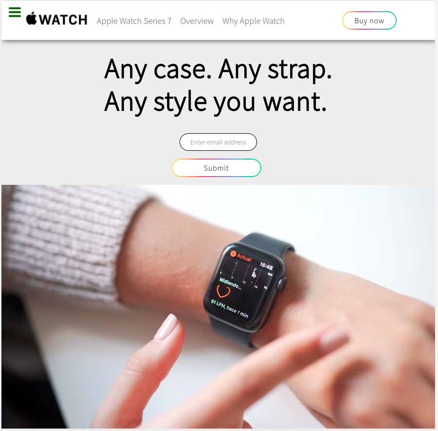

# Product-Landing-page - FreeCodeCamp project

### During my learning, I tried to get inspiration from other websites and  create replicas of their elements.

#### As part of FreeCodeCamp's Responsive Web Design course, I built a product landing page,  with elements replicated from ***Apple Official Site***.

***

#### This page uses `HTML` and `CSS` and helped get more practice with:

* Creating a mobile-first responsive design
* Using CSS and HTML to create responsive navigation
* Modify scroll-behavior 
* Increase user interactivity by the use of elements like checkboxes, hover effects and transitions 
* Represent elements from the interface in terms of CSS Viewport Units

#### While building this page, I gained more knowledge in: 

* Importance of Semantic HTML
* How to use pseudo-elements
* CSS Viewport Units

***
***

#### Check out the result:

